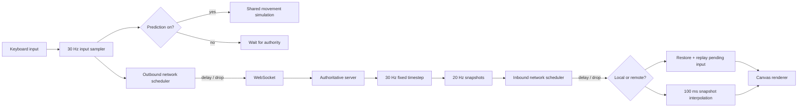
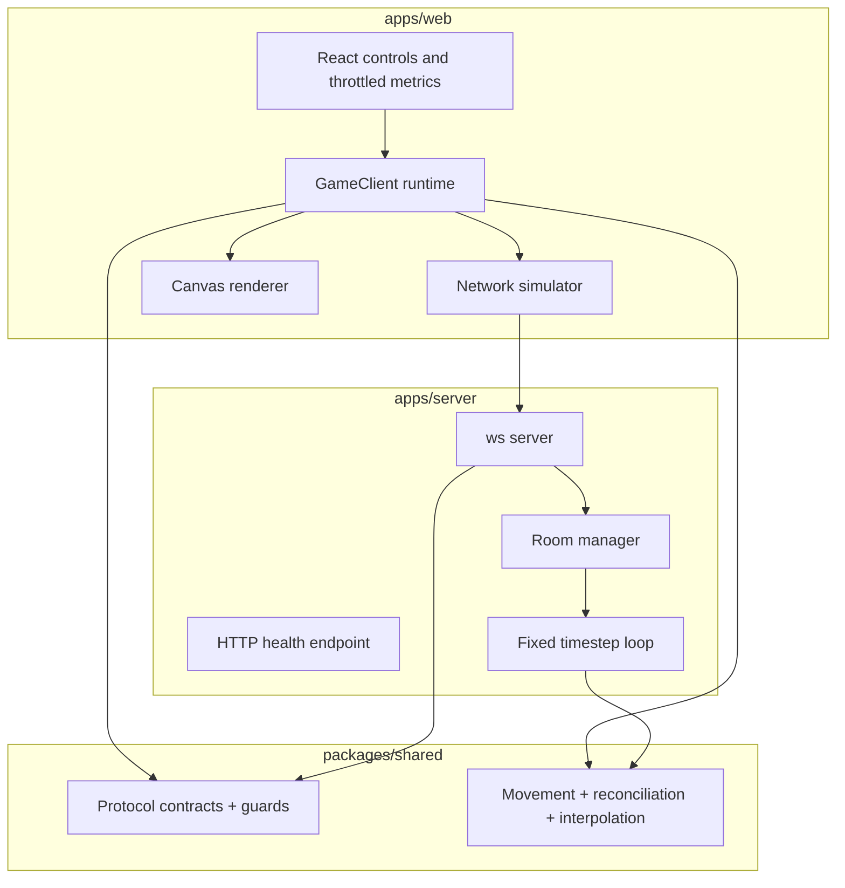

# SyncLab

SyncLab is an interactive real-time multiplayer networking laboratory. Two players move through a deliberately tiny tag arena while a dense diagnostics interface makes client-side prediction, server reconciliation, snapshot interpolation, latency, jitter, and packet loss visible. It is an engineering tool first: the arena only gives the networking system something concrete to synchronize.

## Live demo

Deployment URLs can be added after the first Vercel and Railway release. The repository is configured for both platforms.

## Try the idea in 30 seconds

1. Open the same room link in two tabs and click each arena to focus it.
2. Select the **200ms** preset and move with WASD or the arrow keys.
3. Turn **Client prediction** off. Local input now waits for the server round trip.
4. Turn prediction back on. Movement is immediate, while the cyan authoritative marker remains visible with `?debug=true`.
5. Select **Jitter**, turn **Remote interpolation** off, and move the other tab. Snapshot unevenness becomes visible.

The three netcode switches alter the implementation path. They do not add a cosmetic effect.

## What this demonstrates

- **Authoritative server:** clients submit sequenced input vectors. Only the server owns positions, collisions, the tag state, and tag counts.
- **Fixed timestep:** an accumulated monotonic clock advances the server simulation at 30 Hz, with capped catch-up work after an event-loop stall.
- **Client-side prediction:** the local client applies the same shared movement function immediately instead of waiting for a round trip.
- **Server reconciliation:** an authoritative snapshot restores local state, acknowledged inputs are removed, and the remaining input buffer is replayed.
- **Snapshot interpolation:** remote players render 100 ms in the past between timestamped authoritative snapshots.
- **Network simulation:** a deterministic scheduling layer delays or drops whole application messages in both client → server and server → client directions.
- **Live diagnostics:** rolling RTT, real server rates, pending inputs, acknowledgements, prediction error, correction count, packet counters, room population, and connection state update four times per second.

## Architecture





### Protocol flow

Clients never submit coordinates.

```text
INPUT #107 → INPUT #108 → INPUT #109
        simulated network
                ↓
server validates, queues, and applies fixed-delta movement
                ↓
SNAPSHOT #9182 + ACK #108
                ↓
client removes ≤108 and replays #109 from server position
```

## Why prediction exists

At 200 ms RTT, a client that waits for the server cannot show its own movement for roughly a fifth of a second. That delay feels disconnected from the key press. Prediction runs the agreed movement rule locally at input time, so the avatar responds immediately while the same input travels to the authoritative server.

## Why reconciliation exists

Prediction is an estimate. Packet loss, delayed inputs, boundaries, and interactions with another player can make the estimate differ from the server. Snapshots acknowledge the last processed input. SyncLab restores the server position, discards acknowledged commands, and replays only commands the server has not seen yet. Small render-space corrections are eased without changing the corrected simulation state.

## Why interpolation exists

Remote clients cannot safely predict another player's future input. Rendering each snapshot as it arrives exposes uneven delivery timing as visible stutter. SyncLab keeps a bounded, ordered snapshot buffer and renders the peer 100 ms behind server time, interpolating between known states instead of guessing ahead.

## Repository structure

```text
apps/
  web/       Next.js App Router UI, canvas, transport, prediction, diagnostics
  server/    persistent Node.js + ws authoritative server
packages/
  shared/    protocol types, runtime guards, constants, and simulation math
docs/
  case-study.md
```

## Running locally

Requirements: Node.js 20.9 or newer and pnpm 10 or newer.

```bash
pnpm install
cp apps/web/.env.example apps/web/.env.local
pnpm dev
```

On Windows PowerShell, the environment copy command is:

```powershell
Copy-Item apps/web/.env.example apps/web/.env.local
```

Open [http://localhost:3000](http://localhost:3000). The WebSocket server listens on `ws://localhost:8080`, and its health endpoint is [http://localhost:8080/health](http://localhost:8080/health).

Useful checks:

```bash
pnpm typecheck
pnpm lint
pnpm test
pnpm build
```

Add `?debug=true` to a room URL to display authoritative, predicted, rendered, and remote snapshot markers.

## Deployment

### Railway server

1. Create a Railway service from this repository and keep the repository root as the service root.
2. Railway reads `railway.json`, installs the frozen workspace, builds the shared package and server, then starts `@synclab/server`.
3. Railway supplies `PORT`; no custom value is required.
4. Confirm `https://<railway-domain>/health` returns `{ "ok": true, ... }`.
5. Copy the public WebSocket URL using `wss://`.

### Vercel client

1. Import the same repository into Vercel with the repository root as the project root.
2. `vercel.json` builds the shared package and the web workspace, then serves `apps/web/.next`.
3. Add `NEXT_PUBLIC_WS_URL=wss://<railway-domain>` in Production, Preview, and Development as appropriate.
4. Deploy, then open two tabs with the same `?room=` value.

No secrets are required. The public URL is intentionally a browser-visible environment value.

## Technical decisions

- **WebSockets:** bidirectional, persistent delivery makes protocol flow easy to observe without polling. The server is a normal persistent process, not a serverless handler.
- **Authoritative server:** positions from clients would make teleporting trivial and would move collisions and tag outcomes outside a single source of truth.
- **30 Hz simulation:** frequent enough for this movement lab while leaving timing and correction behavior legible. An accumulator prevents permanent slow motion after timer drift.
- **20 Hz snapshots:** separates simulation fidelity from bandwidth and gives interpolation meaningful gaps to bridge.
- **Input commands represent fixed steps:** each accepted command advances the shared movement rule by one fixed delta. Missing commands therefore create real divergence for reconciliation to correct.
- **Interpolation instead of remote prediction:** the client knows its own current keys but not a peer's next keys. Rendering slightly in the past uses known data and avoids speculative remote behavior.
- **Simulation and render state differ:** authoritative and predicted positions remain exact; a decaying render offset softens only small corrections.
- **Canvas outside React:** `requestAnimationFrame` reads the mutable game runtime directly. React receives metrics and bounded event history at 4 Hz, avoiding packet-rate or frame-rate component rerenders.
- **Small dependency surface:** `ws` is the only server runtime dependency. There is no database, authentication layer, game engine, or state-management library.

## Robustness

- Incoming messages use discriminated runtime guards and reject malformed, non-finite, out-of-range, or unsafe sequence values.
- WebSocket payloads are capped at 16 KiB and connections are capped at 120 messages per second.
- Input queues, pending input history, snapshots, and network events are bounded.
- Reconnect uses bounded exponential backoff and stops after six failed attempts until the user retries.
- A room is removed as soon as its final player disconnects.
- Snapshot insertion handles out-of-order delivery and ignores duplicate ticks.

## Limitations

- WebSockets run over TCP. Real-time games commonly use UDP-based transports to avoid head-of-line blocking; SyncLab simulates application-message delay and loss for education, not TCP packet behavior.
- The room process is in-memory and single-instance. It does not coordinate rooms across regions or server replicas.
- There is no lag compensation for historical hit detection because the only interaction is a simple proximity tag.
- Inputs are fixed-step commands rather than a production game's richer input-state stream with redundancy and compression.
- The deterministic simulator is seeded per room, but it is not a record/replay system and does not promise identical schedules across different browser sessions.

## Case study

The longer technical narrative is in [docs/case-study.md](docs/case-study.md).
